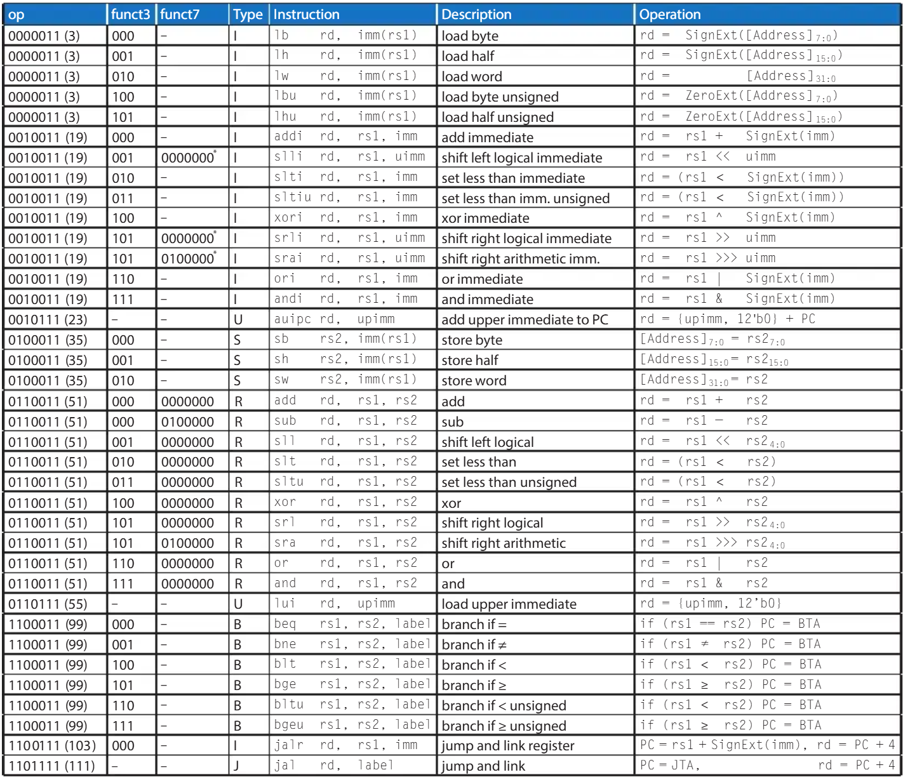

# RV321-RISC-V-SoC-
Goal 1: single cycle RV32I RISC-V CPU implemented in systemverilog verfified with self build testbench suites. Simulated using verilator and waveforms generated using GTKwave. Initial implementation should support base integer instructions:
 

# Block Diagram

# Design Decisions
10 op ALU can make all the other instructions, only need muxes  
SLT/SLTU distinction  
how immediates are extracted/sign-extended  
testbench reasoning  

# Testing/Verification

# Build/Run instructions for Make
WSL  
Verilator 5.020 2024-01-01 rev (Debian 5.020-1)  
GTKWave Analyzer v3.3.116 (w)1999-2023 BSI  

explain makefile  
make Sim TOP = "filename"  

# Demo/video

